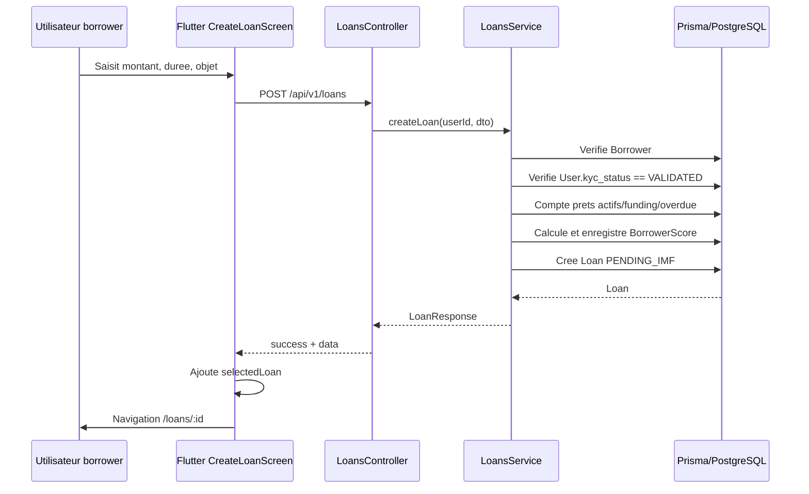
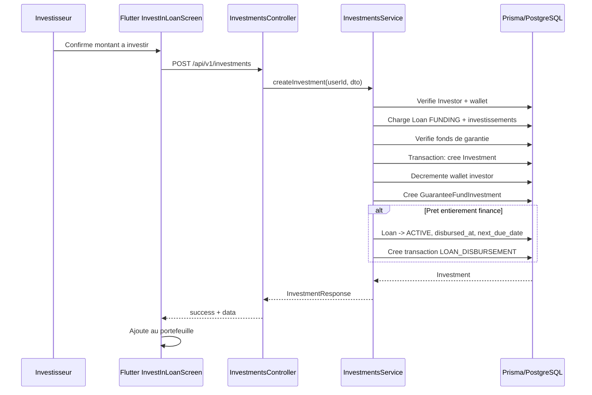
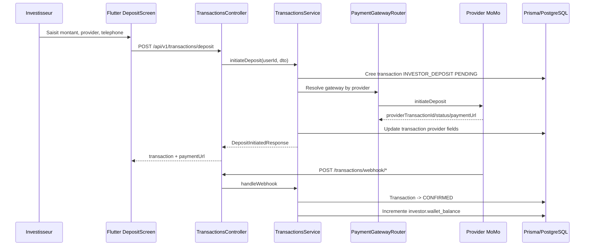
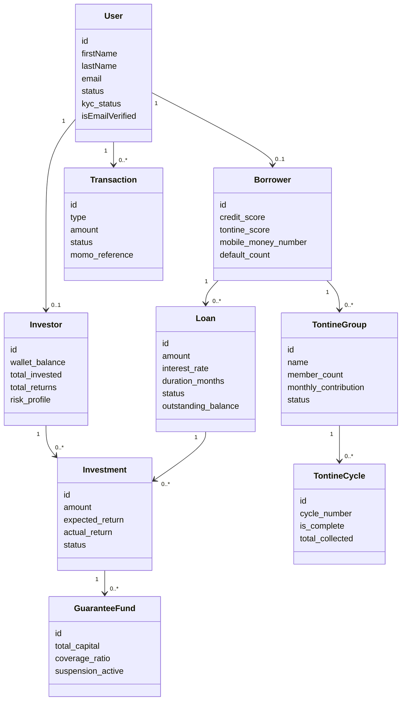
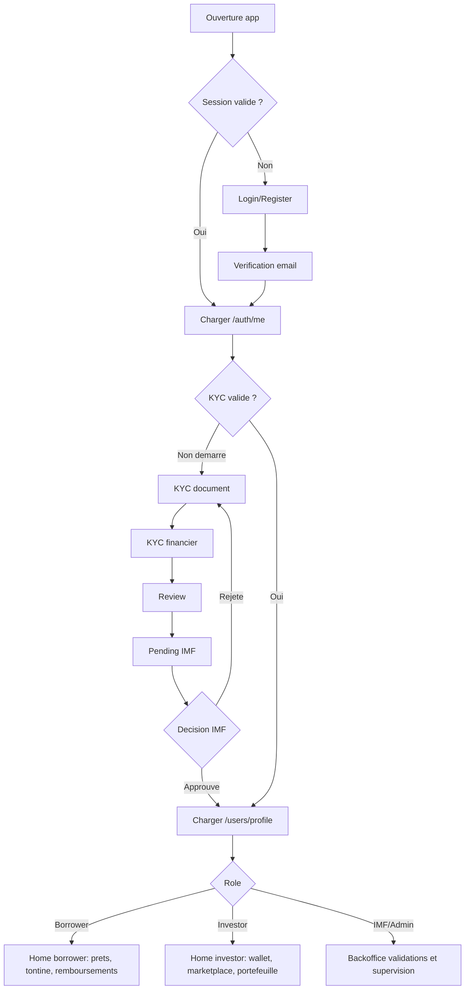

# Audit technique Nexus - Frontend / Backend

Date d'audit: 2026-05-08  
Base analysee: code local du monorepo `/home/dylankode/Soutenance/nexus`

## 1. Synthese executive

Nexus est une application de pret P2P orientee Benin / UEMOA. Le backend NestJS + Prisma est la source de verite la plus structuree: il modelise l'authentification, le KYC progressif, les roles metier, les prets, investissements, tontines, transactions Mobile Money, fonds de garantie, fonctions admin, agents et IMF staff.

Le frontend Flutter existe deja avec une navigation complete pour le parcours client mobile: auth, KYC, accueil, prets, investissements, tontine, wallet et profil. En revanche, plusieurs contrats frontend/backend sont incoherents. Le probleme principal n'est pas l'absence d'ecrans, mais le decouplage entre les DTO backend en camelCase et les models Flutter qui attendent souvent du snake_case ou une liste directe au lieu d'un objet pagine.

Etat reel:

- Backend: architecture modulaire solide, compilation OK, beaucoup de logique metier operationnelle.
- Frontend: shell et ecrans presents, mais plusieurs flows runtime sont casses par parsing JSON, payloads incomplets ou endpoints inexistants.
- Produit: le coeur fonctionnel reel est `Auth -> KYC -> role borrower/investor -> prets/investissements/wallet/tontine`.
- Back-office: backend tres avance, frontend inexistant pour admin, IMF staff et agents.

## 2. Architecture globale actuelle

### Backend

Stack:

- NestJS 11
- Prisma 7 avec PostgreSQL
- JWT access + refresh token
- ZodValidationPipe pour DTO metier
- Swagger sous `/api/docs`
- Prefix global API: `/api/v1`
- Helmet, CORS, throttling global
- Cron jobs via `@nestjs/schedule`

Modules charges dans `AppModule`:

- `AuthModule`
- `UsersModule`
- `FilesModule`
- `LoansModule`
- `InvestmentsModule`
- `GuaranteeFundModule`
- `TontineModule`
- `TransactionsModule`
- `WalletModule`
- `AdminModule`
- `AgentsModule`
- `ImfStaffModule`
- `LoggerModule`

### Frontend

Stack:

- Flutter
- Riverpod / StateNotifier
- GoRouter avec `StatefulShellRoute.indexedStack`
- Dio singleton + refresh token automatique
- Flutter secure storage
- Theme custom `NexusTheme`

Navigation actuelle:

- Public: `/`, `/login`, `/register`, `/verify-email`, `/forgot-password`, `/reset-password`
- KYC hors shell: `/kyc`, `/kyc/document`, `/kyc/financial`, `/kyc/review`, `/kyc/pending`
- Shell prive avec bottom nav: `/home`, `/loans`, `/investments`, `/tontine`, `/wallet`
- Hors shell prive: `/profile`

## 3. Backend - routes et logique metier

### Auth

Routes:

- `POST /auth/register`: cree un user `PENDING`, hash password, genere OTP email.
- `POST /auth/verify-email`: verifie OTP, active `isEmailVerified`, met `status=ACTIVE`, retourne tokens.
- `POST /auth/login`: refuse email non verifie, compte bloque/suspendu, retourne tokens.
- `POST /auth/resend-otp`
- `POST /auth/forgot-password`
- `POST /auth/reset-password`
- `POST /auth/refresh`: refresh via bearer refresh token + body `refreshToken`.
- `POST /auth/logout`
- `GET /auth/me`
- `PATCH /auth/me`
- `PATCH /auth/change-password`
- `GET /auth/google`
- `POST /auth/google/mobile`
- `GET /auth/google/callback`

Role produit: authentification utilisateur generale. Le role metier n'est pas porte directement par `AuthUser` cote frontend; il est seulement disponible via `/users/profile`.

### Users / KYC

Routes:

- `POST /users/kyc/session-1`: document type, document URL, selfie URL. Status `NOT_STARTED|REJECTED -> SESSION1_DONE`.
- `POST /users/kyc/session-2`: revenus, source, releve MoMo optionnel. Status `SESSION1_DONE -> SESSION2_DONE`.
- `POST /users/kyc/session-3`: soumission finale. Ne change pas `kyc_status`, pose `kycSubmittedAt`.
- `GET /users/kyc/status`
- `GET /users/profile`: profil complet + role determine: `admin`, `imf_staff`, `agent`, `investor`, `borrower`, `user`.
- `GET /users/kyc/pending`: IMF/admin.
- `PATCH /users/kyc/validate/:userId`: IMF/admin, approuve vers `VALIDATED` ou rejette vers `REJECTED`.

Point important: un dossier "en attente" reste techniquement en `SESSION2_DONE` avec `kycSubmittedAt != null`. Le frontend assimile `SESSION2_DONE` a l'etape review, ce qui cree une ambiguite entre "pret a soumettre" et "deja soumis".

### Loans

Routes:

- `GET /loans/my`: prets de l'emprunteur.
- `GET /loans/funding`: marketplace investisseur.
- `GET /loans/pending-imf`: IMF/admin.
- `GET /loans/:id`
- `POST /loans`: creation borrower, KYC `VALIDATED` requis, un seul pret actif/funding/overdue.
- `PATCH /loans/:id/validate`: IMF/admin, `PENDING_IMF -> FUNDING` ou `CANCELLED`.
- `POST /loans/:id/repay`: borrower, statut `ACTIVE|OVERDUE`, reference MoMo unique.
- `POST /loans/:id/sandbox-score`: IMF/admin.

Logique:

- Creation: calcule un score hybride, mensualite, statut `PENDING_IMF`.
- Validation IMF: ouvre le pret au financement (`FUNDING`) ou annule.
- Investissement complet: le service investment passe le pret en `ACTIVE`, simule decaissement.
- Remboursement: cree une transaction `LOAN_REPAYMENT`, diminue outstanding balance, distribue les retours aux investisseurs, cloture si solde a zero.
- Cron quotidien: detecte retard, passe `OVERDUE` puis `GUARANTEE_ACTIVATED`, active la garantie.

### Investments

Routes:

- `GET /investments/my`: portefeuille pagine.
- `GET /investments/my/summary`
- `GET /investments/:id`
- `POST /investments`
- `GET /investments/auto-invest`
- `PUT /investments/auto-invest`
- `POST /investments/auto-invest/run`

Risque backend critique: dans le controller, `GET /investments/:id` est declare avant `GET /investments/auto-invest`. Selon le routage Nest/Express, `/investments/auto-invest` risque d'etre capture comme `id = auto-invest`, puis rejete par `ParseUUIDPipe`. Les routes `auto-invest` devraient etre placees avant `:id`.

Logique:

- Investisseur requis.
- Le pret doit etre `FUNDING`.
- Interdit d'investir dans son propre pret.
- Wallet suffisant requis.
- Fonds de garantie peut suspendre les nouveaux investissements.
- Si le pret est totalement finance: `Loan -> ACTIVE`, date prochaine echeance, transaction `LOAN_DISBURSEMENT`.
- Auto-invest: regle par investisseur, cron toutes les 30 minutes.

### Transactions / Wallet

Routes transactions:

- `GET /transactions/my`: historique pagine.
- `POST /transactions/deposit`
- `POST /transactions/withdraw`
- `POST /transactions/webhook/fedapay`: public.
- `POST /transactions/webhook/kkiapay`: public.
- `GET /transactions/unreconciled`: admin.
- `PATCH /transactions/:id/reconcile`: admin.

Routes wallet:

- `GET /wallet/escrow`: admin.
- `GET /wallet/platform`: admin.
- `GET /wallet/summary`: admin.

Logique:

- Depot: cree transaction pending, initie gateway, webhook confirme et credite wallet investisseur.
- Retrait: verifie solde, decremente wallet immediatement, initie gateway, rembourse en cas d'echec provider.
- Wallet utilisateur mobile n'a pas d'endpoint direct de solde: le frontend calcule un solde a partir des transactions chargees, ce qui est fonctionnellement fragile.

### Tontine

Routes:

- `GET /tontine/my-score`
- `GET /tontine/groups`
- `POST /tontine/groups`
- `GET /tontine/groups/:id`
- `POST /tontine/groups/:id/join`
- `POST /tontine/groups/:id/cycles`
- `PATCH /tontine/cycles/:id/complete`

Logique:

- Borrower requis pour creer/rejoindre.
- Un leader ne peut avoir qu'un groupe `PENDING|ACTIVE`.
- Le leader est membre automatiquement.
- Cycle cree par le leader, beneficiaire doit etre membre.
- Cloture de cycle met a jour `completed_cycles` et recalcule le score tontine du leader.

Endpoint manquant cote backend pour le frontend: `GET /tontine/groups/:id/cycles`. Le backend inclut deja les cycles dans `GET /tontine/groups/:id`.

### Admin, IMF Staff, Agents, Guarantee Fund

Backend expose:

- Admin: dashboard, rapport BCEAO, fonds de garantie, users, statut user, scoring engine.
- IMF Staff: profile, loans pending/validated, dashboard.
- Agents: profile, clients, commissions, dashboard.
- Guarantee Fund: status public authentifie, investments admin, activation admin.

Frontend: aucun shell/admin/IMF/agent dedie. Ces capacites backend sont invisibles dans l'application Flutter actuelle.

## 4. Frontend - ecrans et etat

### Ecrans existants

Auth:

- Splash
- Login
- Register
- Verify email
- Forgot password
- Reset password

Onboarding KYC:

- Intro
- Document
- Financial
- Review
- Pending / Rejected

App client:

- Home
- Loans list
- Loan detail
- Create loan
- Investments portfolio + marketplace
- Investment detail
- Invest in loan
- Auto-invest
- Tontine list/score
- Tontine group detail
- Create tontine group
- Wallet
- Deposit
- Withdraw
- Profile

### Providers / etats

- `authProvider`: session, user, erreur, loading.
- `kycProvider`: statut KYC, etape, URLs documents, rejet.
- `loanProvider`: liste, detail, submission, pagination.
- `investmentProvider`: portefeuille, summary, detail, marketplace, auto-invest.
- `tontineProvider`: score, groupes, detail, cycles.
- `transactionProvider`: transactions, filtre, solde calcule localement.
- `fileUploadProvider`: upload images, utilise par KYC.

### Composants reutilisables

Utilises:

- `NexusButton`
- `NexusCard`
- `NexusInput`
- `KycProgressBar`
- `LoanStatusBadge`

Peu ou pas utilises:

- `NexusStatusChip`: defini mais aucun usage reel detecte.
- `NexusSkeleton` / `NexusCardSkeleton`: definis mais les ecrans ont beaucoup de skeletons locaux.
- Plusieurs widgets internes dupliquent les memes patterns: `_StatusBadge`, `_InfoRow`, `_ProviderSelector`, `_BalanceCard`, `_SkeletonTile`.

## 5. Contrats frontend/backend - incoherences detectees

### Contrat de casing casse

Le backend retourne majoritairement des DTO en camelCase:

- `LoanResponse`: `borrowerId`, `interestRate`, `durationMonths`, `monthlyInstallment`, `createdAt`.
- `InvestmentResponse`: `investorId`, `loanId`, `expectedReturn`, `maturityDate`.
- `TransactionResponse`: `paymentGateway`, `momoReference`, `initiatedAt`, `isReconciled`.
- `TontineGroupResponse`: `leaderUserId`, `monthlyContribution`, `completedCycles`.

Le frontend parse souvent en snake_case:

- `Loan.fromJson` attend `borrower_id`, `interest_rate`, `duration_months`, etc.
- `Investment.fromJson` attend `investor_id`, `loan_id`, `expected_return`, etc.
- `Transaction.fromJson` attend `payment_gateway`, `momo_reference`, etc.
- `TontineGroup.fromJson` attend `leader_user_id`, `monthly_contribution`, etc.

Impact: beaucoup de donnees arrivent a zero, vides, ou provoquent un cast error sur champs requis.

### Pagination mal parsees

Backend retourne:

```json
{
  "success": true,
  "data": {
    "items": [],
    "total": 0,
    "page": 1,
    "limit": 10,
    "totalPages": 0
  }
}
```

Mais le frontend attend une liste directe dans:

- `InvestmentRepository.getMyInvestments`
- `TransactionRepository.getMyTransactions`
- `TontineRepository.getGroups`

Le `LoanRepository` parse correctement `data.items`.

### Payload remboursement pret casse

Backend attend:

- `amount`
- `momo_reference`
- `momo_provider`

Frontend envoie:

- `momo_provider`
- `momo_phone`

Impact: `POST /loans/:id/repay` echoue toujours avec validation Zod.

### Depot wallet retourne une enveloppe differente

Backend `POST /transactions/deposit` retourne un `DepositInitiatedResponse`:

- `transaction`
- `gateway`
- `providerTransactionId`
- `providerStatus`
- `paymentUrl`
- `message`

Frontend tente de parser directement `Transaction.fromJson(api.data)`.

Impact: depot initie cote backend mais parsing frontend incorrect. Il faut lire `api.data.transaction`.

### Tontine score casse

Backend retourne:

- `borrowerId`
- `tontineScore`
- `hasTontineHistory`
- `cyclesParticipated`
- `averagePaymentRate`

Frontend attend:

- `score`
- `completed_cycles`
- `defaulted_cycles`
- `total_contributed`

Impact: score affiche probablement zero ou valeurs vides.

### Endpoint cycles tontine inexistant

Frontend appelle:

- `GET /tontine/groups/:groupId/cycles`

Backend n'expose pas ce GET. Les cycles sont dans `GET /tontine/groups/:id`.

Impact: detail groupe peut charger le groupe, mais le chargement dedie des cycles echoue.

### Auto-invest potentiellement masque par `:id`

Backend declare `GET /investments/:id` avant `GET /investments/auto-invest`.

Impact: `GET /investments/auto-invest` peut etre interprete comme detail d'investissement avec id invalide.

### Role metier non exploite cote frontend

Le backend distingue `borrower`, `investor`, `admin`, `imf_staff`, `agent`.

Le frontend `AuthUser` ne porte pas `role`, `investorData`, `borrowerData`. Les tabs sont affichees globalement et les erreurs 403 servent de controle UX implicite.

Impact:

- Un borrower voit investissements/wallet investisseur.
- Un investor voit prets/tontine borrower.
- Les roles admin/IMF/agent n'ont pas d'interface.

### KYC pending ambigu

Apres session 3, backend conserve `kyc_status=SESSION2_DONE` et ajoute `kycSubmittedAt`.

Frontend `_stepFromStatus(SESSION2_DONE) => review`, sauf apres submit local ou il pousse `/kyc/pending`.

Impact: apres restauration de session, un dossier deja soumis peut revenir sur l'ecran review au lieu de pending, sauf si l'ecran lit explicitement `kycSubmittedAt`.

## 6. Flows utilisateurs reels

### Flow 1 - Inscription email

1. Action utilisateur: remplit formulaire register.
2. Ecran: `RegisterScreen`.
3. Provider: `authProvider.register`.
4. Endpoint: `POST /api/v1/auth/register`.
5. Backend: cree `User`, hash password, statut `PENDING`, `isEmailVerified=false`, genere OTP et envoie email.
6. Reponse: success avec message.
7. Etat frontend: `AuthStatus.unauthenticated`.
8. Navigation: `/verify-email` avec email en `extra`.

### Flow 2 - Verification email

1. Action utilisateur: saisit OTP.
2. Ecran: `VerifyEmailScreen`.
3. Provider: `authProvider.verifyEmail`.
4. Endpoint: `POST /auth/verify-email`.
5. Backend: valide OTP, active email et compte, retourne `accessToken`, `refreshToken`, `user`.
6. Etat frontend: tokens stockes, `getMe`, `AuthStatus.authenticated`.
7. Navigation actuelle: `/home`.
8. Incoherence UX: le router peut ensuite forcer `/kyc` si user non KYC, mais certaines actions naviguent directement `/home`.

### Flow 3 - Login

1. Action utilisateur: email/password.
2. Ecran: `LoginScreen`.
3. Endpoint: `POST /auth/login`.
4. Backend: verifie password, email verifie, status non bloque/suspendu.
5. Reponse: tokens.
6. Frontend: sauvegarde tokens, `GET /auth/me`.
7. Navigation: `/home`.
8. Redirect router: si route privee et email non verifie -> `/verify-email`; si route auth et authenticated -> `_kycRedirect`.

### Flow 4 - Restauration session

1. Action: ouverture app.
2. Ecran: `SplashScreen`.
3. Provider: `authProvider.restoreSession`.
4. Backend: `GET /auth/me`.
5. Frontend: si token OK, `authenticated`, sinon clear session.
6. Navigation: token present -> `/home`, sinon `/login`.
7. Faiblesse: ne force pas toujours le KYC au moment de la navigation initiale, depend du redirect GoRouter.

### Flow 5 - KYC document

1. Action: choix type document + upload document + selfie.
2. Ecran: `KycDocumentScreen`.
3. Service: `FileUploadService` vers `POST /files/upload`.
4. Endpoint KYC: `POST /users/kyc/session-1`.
5. Backend: stocke `kycDocumentType`, `kycDocumentUrl`, `kycSelfieUrl`, status `SESSION1_DONE`.
6. Frontend: state `currentStep=financial`.
7. Navigation: `/kyc/financial`.

### Flow 6 - KYC financier

1. Action: revenu mensuel, source, releve MoMo optionnel.
2. Ecran: `KycFinancialScreen`.
3. Endpoint: `POST /users/kyc/session-2`.
4. Backend: status `SESSION2_DONE`.
5. Frontend: state `currentStep=review`.
6. Navigation: `/kyc/review`.

### Flow 7 - Soumission KYC finale

1. Action: confirmer le dossier.
2. Ecran: `KycReviewScreen`.
3. Endpoint: `POST /users/kyc/session-3`.
4. Backend: ajoute `kycSubmittedAt`; status reste `SESSION2_DONE`.
5. Frontend: `restoreSession`, state pending local.
6. Navigation: `/kyc/pending`.
7. Suite backend attendue: IMF/admin via `PATCH /users/kyc/validate/:userId`.
8. Manque frontend: aucun ecran IMF pour valider.

### Flow 8 - Creation de pret borrower

1. Action: clic creer un pret.
2. Ecran: `CreateLoanScreen`.
3. Endpoint: `POST /loans`.
4. Backend: borrower requis, KYC `VALIDATED`, pas de pret actif, calcule score hybride, cree pret `PENDING_IMF`.
5. Reponse: `LoanResponse`.
6. Frontend: ajoute le pret en tete, navigue `/loans/:id`.
7. Probleme: `Loan.fromJson` attend snake_case alors que backend renvoie camelCase.

### Flow 9 - Validation IMF d'un pret

1. Action utilisateur: inexistante cote frontend.
2. Endpoint backend: `GET /loans/pending-imf`, `PATCH /loans/:id/validate`.
3. Backend: IMF staff requis; approval -> `FUNDING`, reject -> `CANCELLED`.
4. Manque: interface IMF mobile/web.

### Flow 10 - Marketplace investissement

1. Action: onglet investissements, marketplace.
2. Ecran: `InvestmentsScreen`.
3. Provider: `investmentProvider.loadMarketplace`.
4. Endpoint: `GET /loans/funding`.
5. Backend: investor requis, retourne prets `FUNDING`.
6. Frontend: affiche cards et navigue `/investments/invest/:loanId`.
7. Probleme: `Loan.fromJson` attend snake_case.

### Flow 11 - Investir dans un pret

1. Action: saisir montant et confirmer.
2. Ecran: `InvestInLoanScreen`.
3. Endpoint: `POST /investments`.
4. Backend: investor requis, wallet suffisant, pret funding, pas son propre pret, fonds garantie OK.
5. Reponse: `InvestmentResponse`.
6. Frontend: ajoute investment.
7. Si pret totalement finance: backend passe le pret `ACTIVE` et cree decaissement.
8. Probleme: `Investment.fromJson` attend snake_case.

### Flow 12 - Auto-invest

1. Action: ouvrir `/investments/auto-invest`.
2. Ecran: `AutoInvestScreen`.
3. Endpoints: `GET /investments/auto-invest`, `PUT /investments/auto-invest`, `POST /investments/auto-invest/run`.
4. Backend: regle auto-invest, execution manuelle ou cron.
5. Problemes: route potentiellement masquee par `GET /:id`; model Flutter attend snake_case.

### Flow 13 - Wallet depot

1. Action: montant, provider, telephone.
2. Ecran: `DepositScreen`.
3. Endpoint: `POST /transactions/deposit`.
4. Backend: investor requis, cree transaction pending, initie gateway.
5. Reponse: enveloppe avec `transaction` + infos gateway.
6. Frontend: tente de parser l'enveloppe comme transaction directe.
7. Suite reelle: wallet credite uniquement apres webhook provider confirme.

### Flow 14 - Wallet retrait

1. Action: montant, provider, telephone.
2. Ecran: `WithdrawScreen`.
3. Endpoint: `POST /transactions/withdraw`.
4. Backend: investor requis, solde suffisant, decremente wallet, initie gateway, rollback en cas d'echec.
5. Reponse: transaction.
6. Frontend: ajoute transaction.
7. Probleme potentiel: parse snake_case/camelCase.

### Flow 15 - Historique wallet

1. Action: ouvrir `/wallet`.
2. Ecran: `WalletScreen`.
3. Endpoint: `GET /transactions/my`.
4. Backend: retourne objet pagine.
5. Frontend: attend liste directe.
6. Impact: historique probablement casse; solde local faux.

### Flow 16 - Tontine liste et score

1. Action: ouvrir `/tontine`.
2. Ecran: `TontineScreen`.
3. Endpoints: `GET /tontine/my-score`, `GET /tontine/groups`.
4. Backend: borrower requis pour score, groupes publics authentifies.
5. Frontend: score et groupes parsés avec contrats incorrects.

### Flow 17 - Creation groupe tontine

1. Action: creer groupe.
2. Ecran: `CreateGroupScreen`.
3. Endpoint: `POST /tontine/groups`.
4. Backend: borrower requis, leader unique, cree groupe + membre leader.
5. Frontend: navigue `/tontine/groups/:id`.
6. Probleme: parsing camelCase/snake_case.

### Flow 18 - Detail groupe tontine / rejoindre

1. Action: ouvrir groupe.
2. Ecran: `TontineGroupDetailScreen`.
3. Endpoint: `GET /tontine/groups/:id`.
4. Backend: retourne groupe, membres et cycles.
5. Frontend: charge aussi `GET /tontine/groups/:id/cycles`, inexistant.
6. Action rejoindre: `POST /tontine/groups/:id/join`.
7. Backend: ajoute membre si borrower et non membre.

### Flow 19 - Profil

1. Action: ouvrir `/profile`.
2. Ecran: `ProfileScreen`.
3. Endpoints: `PATCH /auth/me`, `PATCH /auth/change-password`, `POST /auth/logout`.
4. Backend: update profil simple, change password, revoke refresh.
5. Frontend: met a jour `AuthUser`, logout vers `/login`.

## 7. Fonctionnalites operationnelles vs incompletes

### Probablement operationnelles apres correction de contrats JSON

- Auth email/password + OTP.
- Refresh token Dio.
- Upload image.
- KYC progressif.
- Creation de pret borrower.
- Marketplace prets funding.
- Investissement manuel.
- Depot/retrait Mobile Money.
- Tontine creation/join/detail.
- Profil utilisateur.

### Incompletes ou invisibles cote frontend

- Validation KYC IMF.
- Validation pret IMF.
- Dashboard admin.
- Rapports BCEAO.
- Reconciliation transactions.
- Gestion fonds garantie admin.
- Agents.
- IMF staff.
- Scoring sandbox.
- Creation/cloture cycles tontine cote frontend.
- Activation garantie admin.
- Wallet admin.

### Casses ou tres fragiles aujourd'hui

- Parsing pagine investments/transactions/tontine.
- Parsing camelCase/snake_case sur loans/investments/transactions/tontine.
- Remboursement pret.
- Depot wallet.
- Auto-invest GET.
- Tontine cycles GET.
- KYC pending apres relance app.
- Solde wallet calcule localement depuis un historique pagine.

## 8. Reconstitution produit reelle

Le produit reel n'est pas une simple app de portefeuille. C'est une plateforme de credit P2P regulee autour de trois acteurs principaux:

1. Emprunteur: verifie son identite, cree une demande de pret, rembourse, peut utiliser son historique tontine pour ameliorer son score.
2. Investisseur: depose des fonds, investit dans des prets IMF-valides, configure auto-invest, retire ses fonds.
3. IMF/Admin: valide KYC et prets, surveille risques, fonds de garantie, reconciliation et rapports.

Parcours logique cible:

1. Register/login.
2. Verification email.
3. KYC.
4. Attribution ou detection role metier.
5. Experience differenciee:
   - Borrower: accueil, mes prets, tontine, remboursements.
   - Investor: wallet, marketplace, portefeuille, auto-invest.
   - IMF/Admin: validations et supervision.

Aujourd'hui, le frontend melange borrower et investor dans un meme shell sans role-aware navigation.

## 9. Recommandations de restructuration frontend

### Priorite P0 - Stabiliser les contrats API

1. Choisir une convention unique de DTO frontend.
2. Recommande: adapter Flutter au camelCase backend, car les services backend retournent deja explicitement ces DTO.
3. Corriger tous les repositories pagines pour lire `data.items`.
4. Corriger les payloads:
   - `RepayLoanRequest`: ajouter `amount` et `momo_reference`, retirer `momo_phone` si inutile.
   - `DepositRepository`: lire `data.transaction`.
5. Corriger `TontineScore.fromJson`.
6. Supprimer `getCycles` ou ajouter l'endpoint backend. Le plus simple: utiliser `cycles` inclus dans `getGroupById`.
7. Deplacer les routes auto-invest avant `GET /investments/:id`.

### Priorite P1 - Navigation role-aware

Introduire un `UserProfileProvider` base sur `/users/profile`, puis construire une navigation selon role:

- Borrower: Home, Loans, Tontine, Wallet remboursements/profil.
- Investor: Home, Marketplace/Investments, Wallet, Auto-invest, Profile.
- Admin: Dashboard, Users/KYC, Loans IMF, Transactions, Reports.
- IMF Staff: KYC pending, Loans pending, validated loans, dashboard.
- Agent: Clients, commissions, assistance.

Ne pas laisser un role decouvrir ses interdictions par 403.

### Priorite P2 - Etat frontend unifie

Creer des abstractions:

- `PaginatedState<T>` commun.
- `AsyncActionState` pour submit/error/loading.
- `ApiPage<T>` pour `items,total,page,limit,totalPages`.
- `ApiExceptionMapper` centralise.
- `MoneyFormatter` et `DateFormatter` centralises.

### Priorite P3 - Fusion / suppression / composants

Refactoriser:

- Unifier `_StatusBadge` via `NexusStatusChip`.
- Unifier les lignes info `_InfoRow`.
- Unifier selectors MoMo depot/retrait/remboursement.
- Unifier skeletons avec `NexusSkeleton`.
- Remplacer le calcul de solde local par un endpoint backend user-wallet ou `/users/profile.investorData.walletBalance`.

Ecrans a ajouter:

- IMF KYC pending/detail/validate.
- IMF loans pending/detail/validate/sandbox.
- Admin dashboard/users/reconciliation/scoring/reports.
- Tontine cycle create/complete.
- Etat KYC submitted distinct de review.

Ecrans a ajuster:

- Home: afficher actions selon role.
- Loans: borrower seulement ou marketplace separee.
- Investments: investor seulement.
- Wallet: investor wallet reel, pas calcul par historique pagine.
- KYC pending: se baser sur `kycSubmittedAt`.

## 10. Plan de remise en ordre

### Phase 1 - Contrats et compilation runtime

- Corriger parsing camelCase dans tous les models Flutter.
- Corriger repositories pagines.
- Corriger remboursement, depot, tontine cycles, auto-invest route.
- Ajouter tests unitaires simples de parsing JSON pour chaque model.

### Phase 2 - Domaine frontend

- Ajouter `UserProfile` complet cote Flutter.
- Ajouter `Role` et guards UI.
- Reorganiser `features` par domaine stable: `auth`, `onboarding`, `borrower`, `investor`, `wallet`, `backoffice`, `shared`.

### Phase 3 - Navigation

- Remplacer shell unique par shell role-aware.
- Garder KYC hors shell.
- Ajouter routes backoffice si le mobile doit servir admin/IMF, ou creer un frontend web admin separe.

### Phase 4 - UX et composants

- Centraliser cards, chips, empty states, skeletons, forms.
- Nettoyer composants locaux dupliques.
- Introduire des states explicites: loading, empty, error retry, forbidden role, pending validation.

### Phase 5 - Couverture

- Tests backend e2e sur flows: auth, KYC, loan, investment, wallet, tontine.
- Tests Flutter repository/model sur fixtures backend reelles.
- Tests navigation redirect selon auth/KYC/role.

## 11. UML

### Cas d'utilisation

```mermaid
usecaseDiagram
actor User as Utilisateur
actor Borrower as Emprunteur
actor Investor as Investisseur
actor IMF as "IMF Staff"
actor Admin as Admin
actor Gateway as "Provider MoMo"

User --> (Creer compte)
User --> (Verifier email)
User --> (Completer KYC)
User --> (Consulter profil)

Borrower --> (Creer demande de pret)
Borrower --> (Rembourser pret)
Borrower --> (Creer groupe tontine)
Borrower --> (Rejoindre groupe tontine)
Borrower --> (Consulter score tontine)

Investor --> (Deposer fonds)
Investor --> (Investir dans un pret)
Investor --> (Configurer auto-invest)
Investor --> (Retirer fonds)
Investor --> (Consulter portefeuille)

IMF --> (Valider KYC)
IMF --> (Valider pret)
IMF --> (Evaluer score sandbox)

Admin --> (Consulter dashboard)
Admin --> (Generer rapport BCEAO)
Admin --> (Reconciler transactions)
Admin --> (Configurer scoring)
Admin --> (Gerer fonds de garantie)

Gateway --> (Confirmer depot/retrait par webhook)
```

### Sequence - creation de pret



### Sequence - investissement et activation pret



### Sequence - depot wallet



### Diagramme de classes domaine simplifie



### Activite - parcours utilisateur cible



## 12. Verification outillage

- Backend: `npm run build` execute avec succes.
- Frontend: `flutter analyze` a necessite l'autorisation d'ecrire dans le cache Flutter hors workspace, puis a echoue avec 5 issues:
  - `analysis_options.yaml` inclut `package:flutter_lints/flutter.yaml`, mais `flutter_lints` n'est pas declare dans `dev_dependencies`.
  - 4 usages deprecies de `Color.withOpacity`, a remplacer par `withValues()`.

## 13. Conclusion

Le backend porte une vision produit claire et avancee. Le frontend est structure par features et couvre visuellement le parcours client, mais il n'est pas encore aligne contractuellement avec le backend. La priorite absolue est de reparer les DTO, la pagination et les flows casses avant toute refonte visuelle.

La restructuration frontend doit partir des roles et du KYC, pas seulement des tabs actuelles. Une fois les contrats stabilises, l'application peut devenir coherente rapidement: le backend a deja la majorite des briques metier necessaires.
